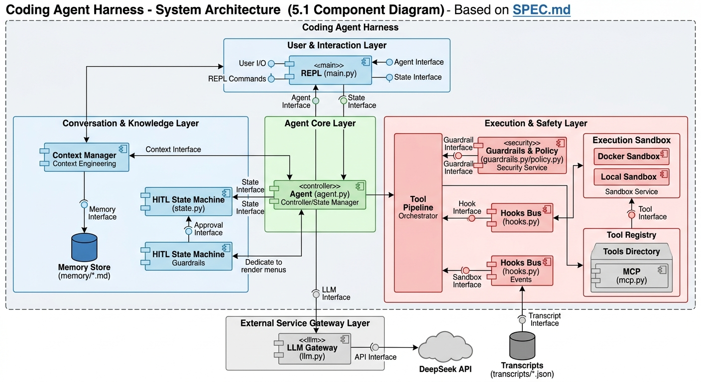

# Coding Agent Harness

一个真实的编码智能体框架（Python 3.11+，Windows/Linux）

设计规格见 `docs/superpowers/specs/SPEC.md`（下文以 `§x.y` 引用章节号）。
## 组件图（SPEC §5.1）



职责划分：Agent 只负责循环与状态；工具流水线只负责"一次调用"的判定-执行；
护栏/策略/钩子/沙箱各自单一职责；状态机是交互主轴。完整数据流见 SPEC §5.2。

## 快速开始

1. **安装**（PyPI 分发，任选其一）：

   ```bash
   pip install nju-coding-agent-harness        # PyPI 正式发布
   pip install -e ".[dev]"                     # 源码分发（项目根目录）
   ```

2. **配置 API Key**：首次运行时会自动进入配置向导（`getpass` 隐藏输入，
   保存到系统凭据库）；也可以在 REPL 内用 `/key set` 随时配置（见下文
   "凭据安全"）。

3. **运行**：

   ```bash
   cah                       # 等价 python -m harness.main
   ```

   提示符 `> ` 下直接输入任务（例如"修复 main.py 里的 bug"）；**首次输入
   （即使以 `/` 开头）一律视为任务**。REPL 顶部 `Ctrl+C` 干净退出并触发
   SessionEnd 钩子；任务运行中 `Ctrl+C` 弹出暂停菜单（resume / abort）。

## 凭据安全

- **来源优先级**：keyring（Windows Credential Manager，服务名
  `coding-agent-harness`）→ 项目根目录 `.env` 文件（`DEEPSEEK_API_KEY=...`）
  → 首次运行向导。
- **首选 keyring**：操作系统加密存储，凭据不出本机。`/key set` 交互录入
  （隐藏输入）后可选"验证密钥"（调 `{base_url}/models` 轻量确认，通过后
  才写入 keyring 并记录验证时间；失败提示重输、不落盘）；`/key clear`
  删除 keyring 凭据（来源为 `.env` 时只提示手动删除）；`/key status` 只回显
  "是否已配置 / 来源 / 验证时间"，**绝不回显明文**。
- **`.env` 明文风险**：`.env` 文件是本地明文（`DEEPSEEK_API_KEY=...`），
  且其中的值会进入进程环境、对同一用户的其他进程可见；不要提交进 Git
  （仓库已通过 `.gitignore` 排除 `.env`，凭据扫描测试
  `harness/tests/test_security_scan.py` 会检查 key 不落入源码/历史/转录）。
  使用 `.env` 是备选方案，请确保文件权限收紧。
- **兜底安全**：key 永不写入日志、转录、记忆或策略文件。

## 代理配置（GitHub / DeepSeek，Windows）

- **DeepSeek API**：默认直连 `https://api.deepseek.com`（HTTPS）。需要
  代理时，为 `openai`/`httpx` 设置环境变量即可：

  ```powershell
  $env:HTTPS_PROXY = "http://127.0.0.1:7890"
  $env:HTTP_PROXY  = "http://127.0.0.1:7890"
  ```

  （PowerShell 中设置环境变量仅对当前会话有效，不会进入 shell history；
  请勿用 `export` 方式写入 key，那会进入 shell history。）
- **GitHub**（克隆仓库、拉取技能时）：给 git 配代理

  ```bash
  git config --global http.proxy http://127.0.0.1:7890
  git config --global https.proxy http://127.0.0.1:7890
  ```

- **Windows 注意**：命令执行基于系统 shell；若在工作区使用 PowerShell
  脚本或路径含空格/中文，注意引号与编码（项目文件统一 UTF-8）。

## 配置（harness/config.py）

`Config` dataclass 定义全部配置字段（`Config.load(path)` 支持 TOML
配置文件加载；REPL 启动时使用默认值）：

| 字段 | 默认值 | 含义 |
|---|---|---|
| `model` | `deepseek-chat` | 模型名 |
| `base_url` | `https://api.deepseek.com` | OpenAI 兼容端点 |
| `max_steps` | `50` | 每任务步数上限 |
| `failure_budget` | `3` | 同类工具连续失败预算（§3.6） |
| `tool_timeout` | `30` | 工具执行超时（秒） |
| `memory_top_k` | `2` | 任务启动时检索注入的记忆块数（§3.3） |
| `max_budget_tokens` | `6000` | 上下文预算，超出先压缩（§3.3） |
| `compression_keep_turns` | `10` | 压缩保留的最近回合数 |
| `compression_max_rounds` | `3` | 单任务压缩轮数上限 |
| `max_output_bytes` | `51200` | 工具输出截断上限 |
| `workspace` | 当前目录 | 工作区（文件/记忆/技能/转录根） |
| `mcp_servers` | `[]` | MCP 服务器列表（§5.3） |

## REPL 命令表

实现于 `harness/main.py`（`/help` 输出与之对应）：

| 命令 | 行为 |
|---|---|
| `/exit` | 退出 REPL（返回 0） |
| `/reset` | 重置会话（重建 Agent，清空上下文与状态）；失败打印"重置失败" |
| `/skills` | 列出工作区 `skills/` 下含 `SKILL.md` 的技能 |
| `/rules` | 显示策略规则表：`pattern -> action (source)` |
| `/rules drop skill:<name>` | 移除指定技能注入的规则 |
| `/key set` | 交互录入 API Key 并保存到 keyring，随后重新初始化会话 |
| `/key status` | 显示配置状态（是否已配置 / 来源 / 验证时间） |
| `/key clear` | 清除 keyring 中的 API Key |
| `/memory` | 列出工作区 `memory/` 下的记忆文件 |
| `/help` | 命令摘要 |

交互行为（与实现一致）：

- **首次输入即任务**：第一个非空输入（包括以 `/` 开头的字符串）作为任务执行。
- **任务中 Ctrl+C**：状态机 `interrupt → paused`，弹出编号菜单
  `1. resume / 2. abort`；EOF 视为 abort。选择 abort → `terminated`；
  选择 resume → 从暂停处继续（仅允许恢复一次）。
- **REPL 顶层 Ctrl+C / EOF**：打印换行、触发 SessionEnd 钩子（写转录）后退出。
- **护栏 ask**：打印 `? 问题` + 编号选项，输入非编号数字重试。
- **任务收尾**：逐条回显工具调用 `→ name: args`（失败为 `⊘ name: error`），
  最后打印 `[step N/max | ~T tok]` 步数与近似 token 统计。
- **流式输出**：模型文本通过 `on_text` 实时打印，无整轮缓冲（§3.1）。
- **API 失败**（密钥错误 / 限流 / 网络）：打印明确提示，**会话保持存活**，
  可继续输入任务或 `/key set`。

## 六维度组件（§3）

| 维度 | 组件 | 验证要点 |
|---|---|---|
| 治理护栏 | `guardrails.py` / `policy.py` / `state.py`（§3.4 §11.2 §11.4） | 护栏先行、ask 无超时放行、自适应升降级 |
| 安全沙箱 | `sandbox.py`（§11.3） | 超时/截断、docker 隔离；**local 非隔离（见下）** |
| 记忆 | `memory.py`（§3.3） | 纯标准库 TF-IDF、top-k 注入、收尾整合 |
| 上下文工程 | `agent.py`（预算/压缩）+ `llm.py`（§3.1 §3.3） | 超预算先压缩、保留最近 N 回合、轮数上限 |
| 人机协同 HITL | `main.py` / `state.py` / `tools/ask.py`（§11.4） | interrupt→paused、awaiting_user 双来源 |
| 反馈闭环 | `agent.py`（失败预算）（§3.6） | 连续失败 3 次停止、错误回灌可修正 |

配套能力：工具注册表 `registry.py`、内置工具 `tools/`（bash/files/search/web/
notes/memory/skills/subagent/ask）、MCP 客户端 `mcp.py`、钩子 `hooks.py`、
转录 `transcript.py`、凭据 `credentials.py`、LLM 客户端 `llm.py`。

## 沙箱非隔离性声明（重要，§11.3）

**`LocalSandbox`（默认后端）不是安全边界**——它在宿主上直接以子进程执行
shell 命令，隔离由**护栏**（危险模式 deny / ask）与**路径包含性检查**
（工作区外路径 deny）承担第一道防线。若需要真正的进程/文件系统隔离，
请配置 **DockerSandbox** 后端。

## Docker 后端（可选，默认 local）

- 通过配置切换沙箱后端；docker 后端用 `docker run --rm` 执行 bash，默认
  `--network=none`（无网络），以 `-v <workspace>:/workspace` 挂载工作区，
  容器内无法破坏宿主文件系统、读不到宿主凭据。
- 镜像默认 `python:3.11-slim`，需预装工具链（python/git 等）。
- 未安装 Docker 或 daemon 未运行时快速报错，可回退 local。
- Windows：需 Docker Desktop 并保持运行；挂载路径请使用绝对路径。

## 测试

[](https://github.com/clementineyyy/Coding-Agent-Harness/actions/workflows/ci.yml)

**一键运行**（GitHub Actions CI 与本地使用同一命令）：

```bash
make test
```

- `make test` 自动完成：`.venv` 不存在则创建 → `pip install -e ".[dev]"`
  → `pytest harness/tests -q`（Windows 用 `.venv\Scripts\python.exe`，
  POSIX 用 `.venv/bin/python`，Makefile 内通过 `$(OS)` 自动判断）。
- **Windows 无 make** 时的等价命令：

  ```powershell
  python -m venv .venv
  .venv\Scripts\python.exe -m pip install -e ".[dev]"
  .venv\Scripts\python.exe -m pytest harness/tests -q
  ```

- 只安装不跑测试：`make install`。

### 机制演示（§A.4-D 对齐）

`make demo` 顺序运行三个机制演示脚本（全部退出码 0 即通过）：

1. **demo_1_guardrail_deny** — 护栏拦截危险动作：FakeLLM 请求
   `rm -rf` / 网络访问等危险动作时，护栏在**执行前**拒绝（deny），
   绝不让危险命令进入沙箱执行；
2. **demo_2_feedback_change** — 反馈闭环：工具失败的错误信息回灌
   上下文后，模型的**下一步动作发生改变**（重试 → 换用替代命令）；
3. **demo_3_hitl_trace** — HITL 状态机全轨迹确定性复现：
   `ask → awaiting_user → 执行 → completed` 完整状态迁移。

其中 **demo ③（HITL 状态机全轨迹确定性复现）对应 §A.4-D"主要贡献"
清单中的重点维度**：以确定性方式复现人机协同的关键状态序列，作为
该贡献的可运行证据（配合 `test_mechanism_demo.py` 的自动化包装）。

### 离线确定性测试

- 全部测试**无网络依赖、不访问真实 LLM**：由 FakeLLM 客户端与
  `httpx.MockTransport` 驱动，可离线、确定性复现；MCP 测试使用手写的
  假 stdio 服务器子进程，不联网。
- 主要测试文件：
  `test_agent_core.py` / `test_agent_feedback.py` / `test_agent_context.py` /
  `test_agent_end.py`（六维度组件单测）、`test_repl.py`（REPL 行为）、
  `test_acceptance_matrix.py`（验收矩阵，逐条对应 §9）、
  `test_mechanism_demo.py`（机制演示包装，对应上文 demo ①②③）、
  `test_llm.py`（LLM 客户端，httpx MockTransport）。
- 其余覆盖：护栏/状态机/策略/记忆/沙箱/钩子/MCP/凭据扫描
  （`test_security_scan.py`）/性能冒烟（`test_perf_smoke.py`）/文档一致性
  （`test_docs.py`）。

## 已知实现偏差（与 spec 附录的差异）

1. 类型定义集中在 `harness/registry.py`（`Context` / `Tool` / `ToolResult`），
   无独立 `types.py`（`AgentResult` 在 `agent.py`）。
2. MCP 客户端为手写行式 JSON-RPC 2.0（stdio/url），而非官方 `mcp` SDK
   （依赖已安装但未使用）——零网络依赖、可确定性测试（§4.3）。
3. 参数校验为手写轻量 schema 校验（`registry.validate_args`），未引入
   `jsonschema` 依赖（§3.2）。

## 已知限制

- 平台：Windows 10+ / Linux，Python 3.11+；需 DeepSeek 账号与网络连通。
- `mcp_servers` 的 stdio/url 服务器需用户自备；连接失败自动停用，不影响其余。
- Docker 沙箱后端需 Docker Desktop（可选）。
